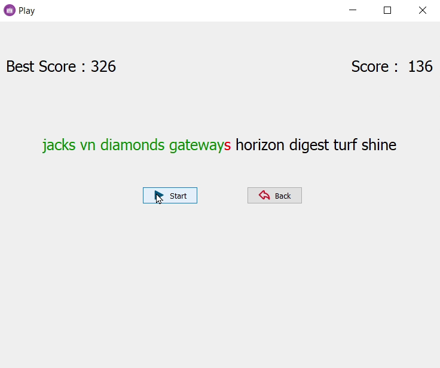

# typing_game
A simple Typing game with GUI which helps you to practice typing by providing random sentences while keeping track of your speed and accuracy. Written in C++, using Qt framework for GUI.

## Requirements to build the application

You need to have Qt creator installed.

## How to build the application

... Will write that soon. (Current deadline : 31st december 2021)

## Usage Details

## Screeenshots and Demo

A demo of initial version https://www.youtube.com/watch?v=7pZhDTyZxzc 

Screenshots

